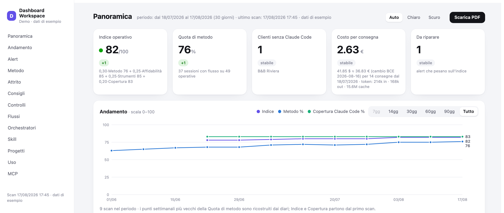

# Claude Studio Dashboard



**Claude Studio Dashboard ti mostra dove il tuo lavoro con Claude Code è già
sistematico, dove resta manuale e cosa conviene automatizzare.**

Uno scanner locale legge i metadati del tuo workspace — diari di sessione,
cartelle dei clienti, connettori, telemetria — e produce una pagina web privata
con i numeri che servono a decidere. Intorno a questo nucleo, i moduli di
contorno: quanto ti costa ogni consegna, quali clienti sono fermi oltre il loro
ritmo, cosa è rotto negli strumenti. Zero inserimento manuale di dati.

**Requisiti** · Claude Code + un workspace organizzato a cartelle · Python 3
(già presente su macOS) · il modulo costi reali è per ora solo macOS · UI e
documentazione in italiano.

> **English** — A local, zero-dependency dashboard that shows where your
> Claude Code work is already systematic, where it is still manual, and what
> is worth automating — plus real cost per delivery, clients drifting past
> their expected cadence, workflow maps and actionable advice. Scanned from
> local metadata only (no file contents, no conversation text ever leaves
> your machine). Setup is a guided interview (`dashboard-setup` skill) that
> adapts to how YOUR workspace is organized. UI and docs are in Italian for
> now.

**[→ Demo live](https://salvatoresalernods.github.io/claude-studio-dashboard/)**
(dati di fantasia, generati da `engine/demo.py`) ·
**[→ Guida alla lettura](https://salvatoresalernods.github.io/claude-studio-dashboard/guida.html)**
(metriche, soglie, esempi, glossario)

**Salta a:** [Cosa misura](#cosa-misura) · [Installazione](#installazione) · [Uso quotidiano](#uso-quotidiano) · [Privacy](#privacy) · [Limiti](#limiti-dichiarati)

## Cosa misura

Le 5 tile in alto:

| Tile | Domanda a cui risponde |
|---|---|
| **Indice operativo** (0–100) | come sto messo, a semaforo? verde ≥80 · giallo 60–79 · rosso <60. Misura affidabilità e ripetibilità, non solo quanto usi Claude: `0,30·Metodo + 0,25·Affidabilità + 0,25·Strumenti + 0,20·Copertura clienti`, dove l'Affidabilità è la «prima stesura buona» (sotto). I pesi sono una scelta dichiarata, non una misura scientifica: la nota mostra sempre gli ingredienti. Senza consegne valutabili nella finestra vale la formula a tre (`0,40/0,30/0,30`) |
| **Quota di metodo** | quanta parte del lavoro segue una ricetta scritta (skill) invece dell'improvvisazione? |
| **Clienti da verificare** | quali clienti sono fermi oltre la loro cadenza attesa? (la lista delle telefonate da fare — la cadenza si può fissare cliente per cliente) |
| **Costo per consegna** | quanto mi costa di Claude ogni file consegnato? (telemetria reale; senza, un proxy in KB) |
| **Da riparare** | quanti problemi concreti toccano gli strumenti in questo momento? |

Il cuore della dashboard sono i moduli sul **metodo**:

- il **Vivaio** — il lavoro che ripeti a mano nelle sessioni libere,
  individuato e proposto come candidato a diventare una skill: la parte
  difficile dell'automazione non è scriverla, è capire cosa merita di esserlo;
- i **flussi trasversali** — quante ricette hanno consegnato per 2+ progetti
  diversi: il riuso dei flussi tra clienti, cioè il metodo che è diventato
  capitale dello studio invece di una procedura una tantum;
- la card **Attrito ed esecuzione** — quanto il lavoro esce bene al primo
  colpo: **prima stesura buona** (il *first-pass yield*: % di consegne
  completate senza interventi successivi — né correzioni in chat, né riprese,
  né ritocchi a mano), **giri di revisione** (il numero medio di iterazioni
  dopo la prima consegna per arrivare al risultato), autonomia dati
  (MCP vs import manuali), consegne a settimana, sessioni "sanguisuga"
  (pesanti, tanti giri, zero consegne). È la misura più vicina alla qualità
  operativa che si possa ottenere leggendo solo metadati.

E poi: grafico di andamento con confronto tra periodi, mappe dei **flussi di
lavoro** reali (chi fa cosa in ogni fase: tu, una skill, un servizio esterno),
le fasi candidate a diventare **agenti**, inventario di
skill/progetti/MCP/plugin e una sezione **Consigli** filtrabile. Le card
portano le etichette del framework
[4D AI Fluency](https://www.anthropic.com/ai-fluency) di Anthropic
(Delega, Descrizione, Discernimento, Diligenza).

## Come funziona

```
┌─ skills/
│   dashboard-setup     ← intervista guidata di primo avvio → scrive config.json
│   dashboard-update    ← "aggiorna la dashboard" → scan + ripubblica la pagina
├─ engine/              ← Python puro, zero dipendenze
│   scan.py             ← scanner: legge SOLO metadati locali
│   metrics.py          ← formule delle metriche decisionali
│   flows.py            ← estrazione dei flussi dai diari di sessione
│   template.html       ← la pagina (tema chiaro/scuro, stampa PDF)
│   demo.py             ← dashboard demo con dati di fantasia (per screenshot)
└─ telemetry/           ← modulo OPZIONALE per i costi reali (macOS)
```

Ogni workspace è organizzato a modo suo: per questo **niente è cablato nel
codice**. Percorsi, nome dell'hub, soglie, valuta, nomi dei flussi e mappe dei
processi vivono in un `config.json` che la skill di setup costruisce
intervistandoti — e che puoi sempre ritoccare a mano.

## Installazione

Come plugin Claude Code (consigliato):

```
/plugin marketplace add SalvatoreSalernods/claude-studio-dashboard
/plugin install claude-studio-dashboard
```

Poi riavvia la sessione e di': **«configura la dashboard»**. La skill di
setup esplora il workspace, ti fa poche domande mirate (dove sono i progetti,
qual è la cartella-hub, che intestazione vuoi, in che valuta i costi), scrive
il config, esegue il primo scan e pubblica la pagina come Artifact privato su
claude.ai — con URL stabile, utilizzabile anche da telefono.

In alternativa, senza plugin:

```bash
git clone https://github.com/SalvatoreSalernods/claude-studio-dashboard
cd claude-studio-dashboard
cp config.example.json /percorso/workspace/dashboard/config.json  # e adattalo
python3 engine/scan.py --config /percorso/workspace/dashboard/config.json
```

## Uso quotidiano

- **«aggiorna la dashboard»** → scan + ripubblicazione sullo stesso URL.
  Uno scan al giorno nei giorni lavorati alimenta lo storico: il grafico
  Andamento e il Confronto periodi si popolano da soli.
- **`python3 engine/scan.py --config … --dump`** → riepilogo a terminale.
- **`python3 engine/scan.py --demo --out demo.html`** → dashboard con dati
  interamente di fantasia, per screenshot da condividere senza esporre i
  clienti (non legge il workspace, non tocca nulla).

## Il config.json

Il riferimento completo è [config.example.json](config.example.json). Le voci
principali:

| Voce | Cosa dice | Default |
|---|---|---|
| `workspace` | radice del workspace Claude Code | *(obbligatoria)* |
| `projects_dir` | cartella dei progetti/clienti | `Projects` |
| `skills_dir` | cartella delle skill nel workspace (con symlink in `~/.claude/skills`); `""` = le skill vivono direttamente in `~/.claude/skills` | `SKILL` |
| `index_file` | indice del workspace che linka skill e progetti; `""` = nessuno (niente alert di indicizzazione) | `CLAUDE.md` |
| `hub_project` | la cartella che rappresenta te (non un cliente): esclusa da "clienti da verificare" | *(vuoto)* |
| `brand` | titolo e sottotitolo della pagina | — |
| `currency` | valuta di vetrina per i costi (conversione dal USD col cambio BCE del giorno) | `EUR` |
| `thresholds` | tutte le soglie (cliente da verificare, vivaio, sanguisughe…) | vedi esempio |
| `cadenza_clienti` | cadenza attesa per singolo cliente, in giorni (mensili, stagionali, in pausa…): sostituisce `freddo_giorni` per quel cliente | `{}` |
| `flow_names` | nome "di finalità" per i flussi delle tue skill (es. `articolo-blog-seo` → "Dal brief all'articolo del blog") | slug della skill |
| `flow_tags` | 1–2 divisioni del lavoro per flusso (SEO, Content, Gestione clienti…) | "Da classificare" |
| `flow_phases` | mappe-processo curate: le attività di ogni flusso, comprese quelle fuori sessione | estrazione automatica |
| `checks` | controlli periodici (log watcher: formato sotto) | nessuno |
| `telemetry` | sonda dei costi reali (vedi [telemetry/README.md](telemetry/README.md)) | attiva se presente |

**Formato dei `checks`** — ogni controllo è uno script/hook TUO che appende al
proprio log righe `[YYYY-MM-DD HH:MM] (exit N)`; la dashboard legge l'ultima
riga e la traduce con la mappa `codes` (`{"0": ["good", "ok"], …}`). Un file
`stamp` opzionale con dentro `YYYY-MM` segna il mese già coperto.

**Formato di `flow_phases`** — per ogni skill, l'elenco delle attività del
processo: `label` (testo), `kind` (`tu` = attività umana fuori sessione,
`skill`, `mcp`, `web`, `in`, `out` = consegna, `artifact` = pubblicazione),
`tool` (etichetta facoltativa) e `detect` (gli eventi del diario che provano
che la fase è avvenuta: `skill:<slug>`, `mcp:<chiave>`, `web`, `out`,
`artifact`, `in:trascrizione`, `in:dati`). Le fasi senza `detect` sono parte
della ricetta ma avvengono fuori da Claude Code. Senza mappa curata, le fasi
si deducono automaticamente dai diari.

## Privacy

Lo scanner legge **solo metadati**: nomi di file e cartelle, conteggi, date,
nomi di skill e server. Mai contenuti di file, mai testo delle conversazioni,
mai valori di chiavi o variabili (delle env esporta solo i NOMI). Tutto gira
in locale; l'unica chiamata di rete dello scanner è il cambio valuta del
giorno (api.frankfurter.app, dati BCE), disattivabile con `currency: "USD"`.
La pagina pubblicata come Artifact è privata, protetta dal login del tuo
account claude.ai.

## Limiti dichiarati

- Lo stato di autorizzazione dei connettori claude.ai è letto dalle cache
  locali: il dettaglio live è in `/mcp`.
- I diari di sessione conservati coprono ~30 giorni: la finestra di misura
  è quella.
- «Prima stesura buona» non vede le modifiche fatte su copie caricate nel
  cloud (es. Google Drive) prima della condivisione.
- Il modulo telemetria è per ora macOS (LaunchAgent); la sonda in sé è Python
  puro e gira anche su Linux (manca il servizio systemd: contributi benvenuti).
- Claude Code, ovviamente: la dashboard misura il lavoro fatto lì.

## Licenza

[MIT](LICENSE) — © 2026 Salvatore Salerno
